# REPORT
# Student:
- Author: A Badilla Olivas
- Student ID: B80874
## Test Machine:
- Processor: Intel(R) Core(TM) i5-12600k CPU @ 3.60GHz (6 p-cores, 6 e-cores)
- RAM: 32gb ddr4 3200mhz
 
## Test methodology:
- The program was tested using the test cases provided by the professor.
- For taking time CLOCK_MONOTONIC was used.
- Each test was repeated 10 times, best 3 times were stored on [Goldbach Execution Times](https://docs.google.com/spreadsheets/d/1jb-0_jDBswWkYpWAfo9KhPag5tq6eycKZbnXduzNVnI/edit?usp=sharing)
- System was on minimal load, no other programs were running.
## Optimization 1:
In this optimization the goal was to distribute the work between threads dynamically. To do this, the program was modified to use dynamic mapping. The implementation uses only shared memory between threads and a mutex to control concurrency.
 
In this sense, the implementation has a work unit index in shared memory. This work unit index represents the current work unit that is ready to be assigned. This variable starts with the count of the array of nodes of information minus one and it is decremented each time a work unit is assigned. A procedure called getNextWorkUnit(). This method will protect the shared variable work unit index and return the next work unit to be assigned. If the work unit index is less than zero, the method will return -1. This means that there are no more work units to be assigned. See [pseudocode](design/goldbach_optimization.pseudo) lines 202-224
 
Furthermore, the goldbach procedure was modified  in a way that threads will enter an infinite loop in which they will try to get a work unit to be assigned. If the work unit index is less than zero, the thread will exit the loop. Otherwise, the thread will get the next work unit to be assigned and will compute its goldbach sums.
See [pseudocode](design/goldbach_optimization.pseudo) lines 347-358
 
## Optimization 2.1:
The first free Optimization used a break to reduce the number of iterations that were done within the procedures to compute goldbach sums even and odd. As shown by the results demonstrated with kcachegrind most of the time was spent on these inner cycles.
### Kcachegrind results Serial
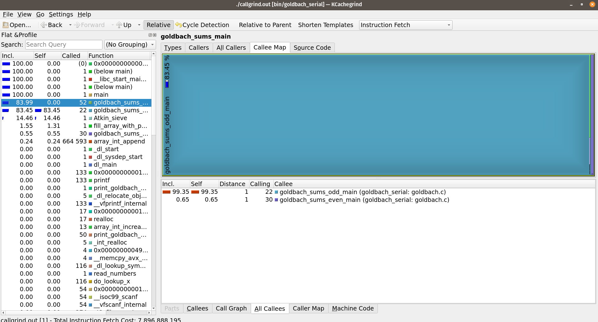
 
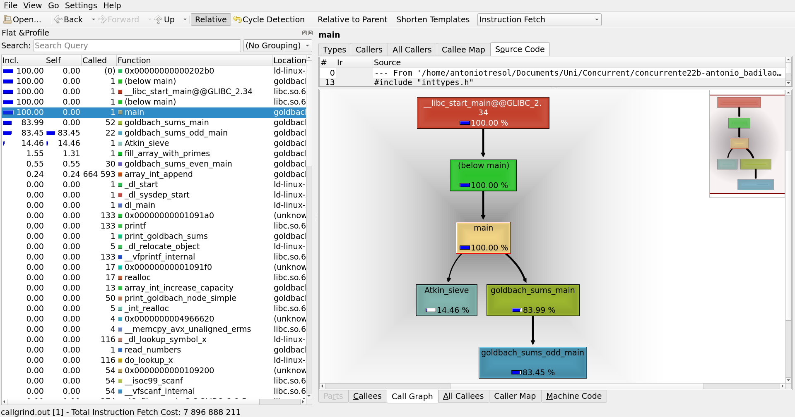
 
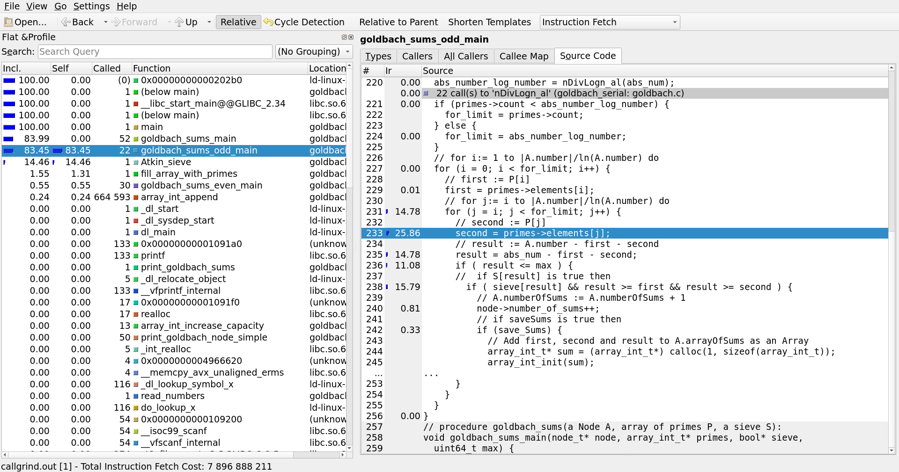
 
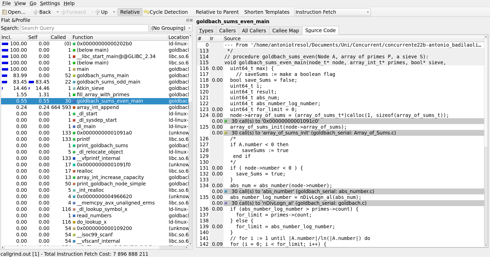
 
### Kcachegrind results Parallel
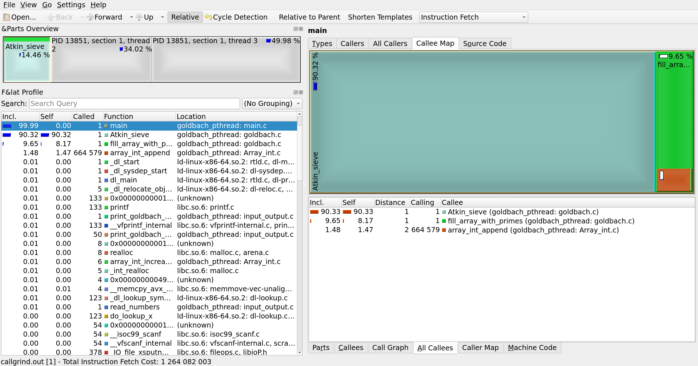
 
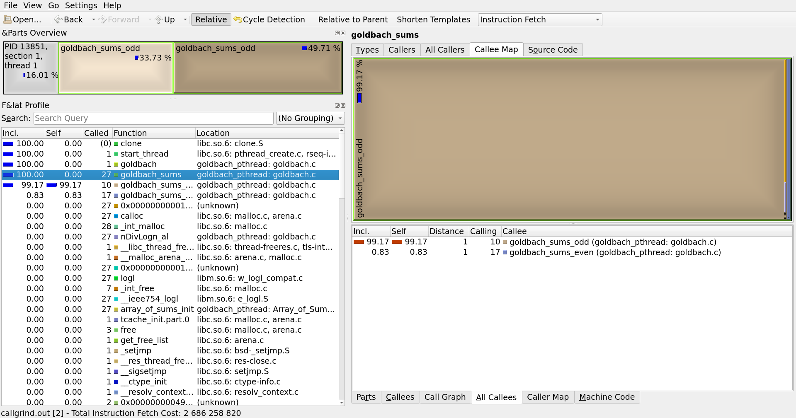
 
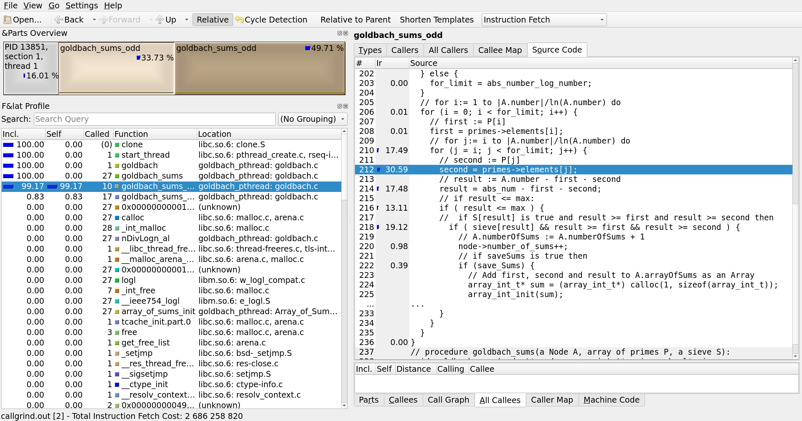
 
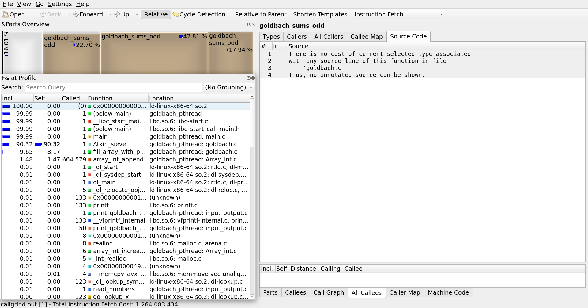
 
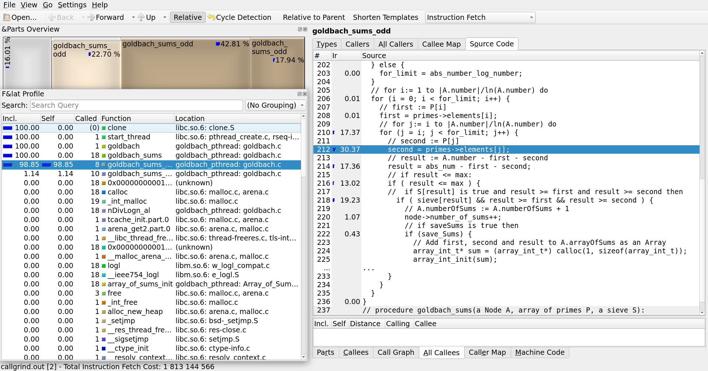
 
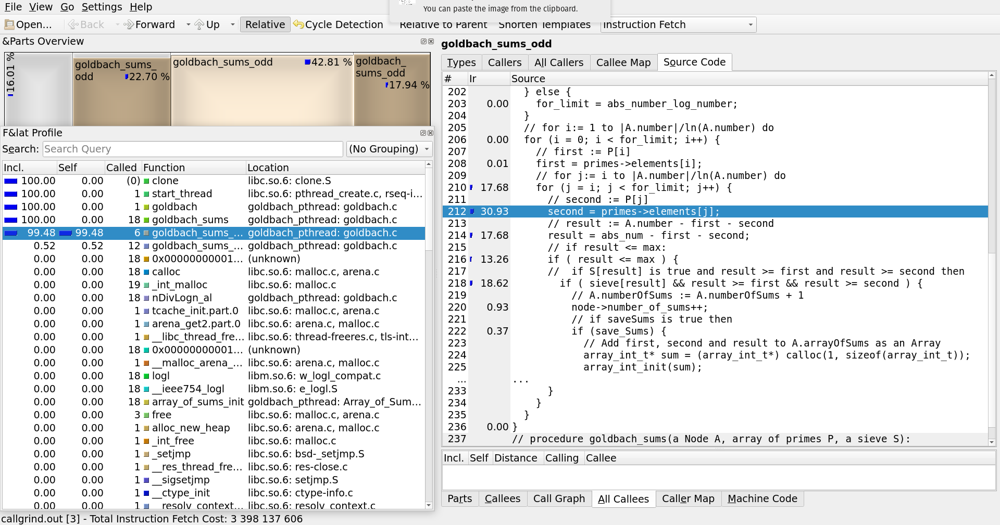
 
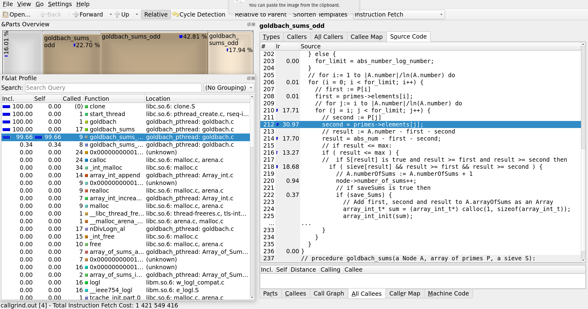
 
 
The first free optimization adds a break when the result was less than zero in [pseudocode](design/goldbach_optimization.pseudo) lines 309 and 262.
 
Before this optimization2.1 and optimization 1, goldbach_pthread was taking ~ 0.3774 seconds to compute all tests (medium and small) on average. After the optimization execution time was reduced to ~ 0.33987 seconds giving a speed up of 1.111.
 
## Optimization 2.2:
The second free optimization overrides the free optimization 2.1. On [pseudocode](design/goldbach_optimization.pseudo) lines 309 and 262, a break is used to stop unnecessary iterations. After observation and revision, it was noted that when the result was less than prime (for even numbers) or less than second (for odd numbers) there was no need to continue iterating.
 
Before this optimization, goldbach_pthread was taking ~ 0.3774 seconds to compute all tests (medium and small) on average. After the optimization execution time was reduced to ~ 0.157626 seconds giving a speed up of 2.394. Most of the time, this optimization reduces the execution time in half for any number of numbers tested.
 
For more information about the execution time of the program, see [Goldbach Execution Times](https://docs.google.com/spreadsheets/d/1jb-0_jDBswWkYpWAfo9KhPag5tq6eycKZbnXduzNVnI/edit?usp=sharing)
 
## Time Complexity Analysis:
 
The time complexity for the goldbach sums even is
$$ O(\pi(n)) $$
 
and for the goldbach sums odd is
$$ O(\pi(n)^2) $$
 
where
$$ \pi(n) = \frac{n}{ln(n)}$$
which is approximately the number of primes less or equal to n.
## Optimization Comparison:
Here are two graphs summarizing speed up and efficiency for the pthread version and optimizations 2.1 and 2.2 with respect to the serial version. These graphs show how these measures evolve with the number of threads used.
 
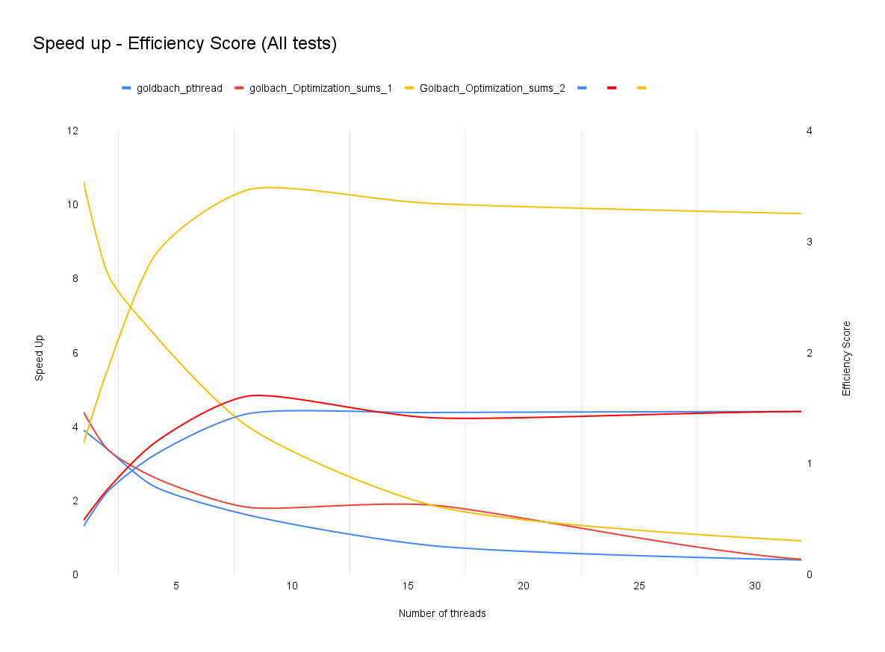
 
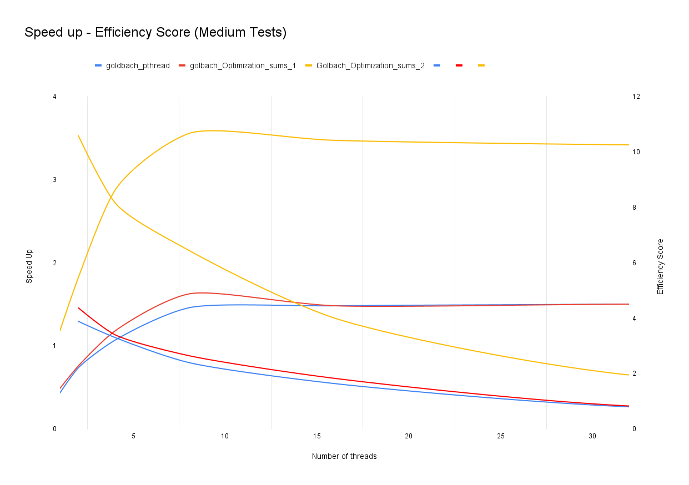
 
The first graph shows the speedup and efficiency for all tests. The second graph shows it for medium tests. The results are similar for all tests and for the medium tests alone. In this graph we can observe how as the thread count increases, there is a speed up increase until a point in which it stagnates. This is expected since the program is parallelized and the more threads are used, the more work is distributed, nevertheless, there is a point in which it will not increase performance with more workers, as explained by the Amdahl's law. Efficiency on the other hand decreases as more threads are employed, since there is a moment in which the cost of the threads is greater than the benefit of the parallelization.
 
In these graphs one important detail to point out is the intersection between the efficiency curve and the speed up curve. The point of intersection between those two will mark the optimal number of threads to be used balancing speed up and efficiency. In this case, the optimal number of threads for the optimization 2.2 for example hovers around 3~4 threads (same for pthread and optimization 2.1). The max performance, at least with the specs of the computer used, is achieved with 8 threads using the optimization 2.2. As mentioned before this optimization on average and speed up of 2.394 compared with the pthread version without optimizations and a speed up of 10.37974 compared with the serial version.
 
It must be said that even with one thread, the optimization 2.2 is faster than the serial version by a substantial margin. While the serial version takes 1.636 seconds on average, the optimization 2.2 takes 0.46229 seconds on average to compute all tests. This means that a thread is doing 3.53 times more work than the serial version. (see [Goldbach Execution Times](https://docs.google.com/spreadsheets/d/1jb-0_jDBswWkYpWAfo9KhPag5tq6eycKZbnXduzNVnI/edit?usp=sharing))
 
## Conclusion:
Therefore the optimization 2.2 is the best optimization for the goldbach program. It is the fastest and the most efficient. The combination of dynamic mapping and profiling gave excellent results. It must be said that as depicted by the graphs there are diminishing returns when more threads are used. One must carefully analyze the needs to solve a problem but also consider the cost of the solution. Even when the best performance was achieved in this example with 8 threads, it might be worth considering, depending on the context,using 4 or 3 as there lies the balance between speed up and efficiency.

