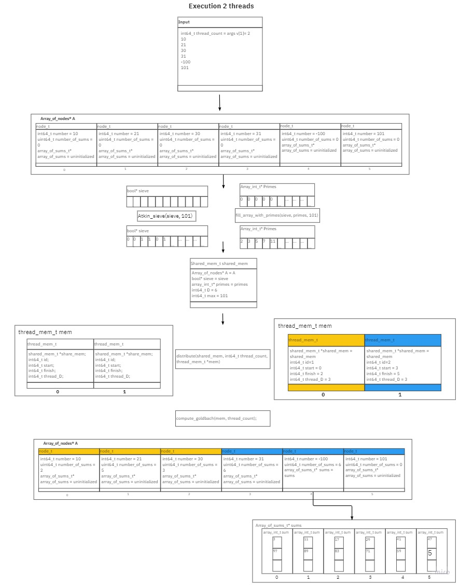
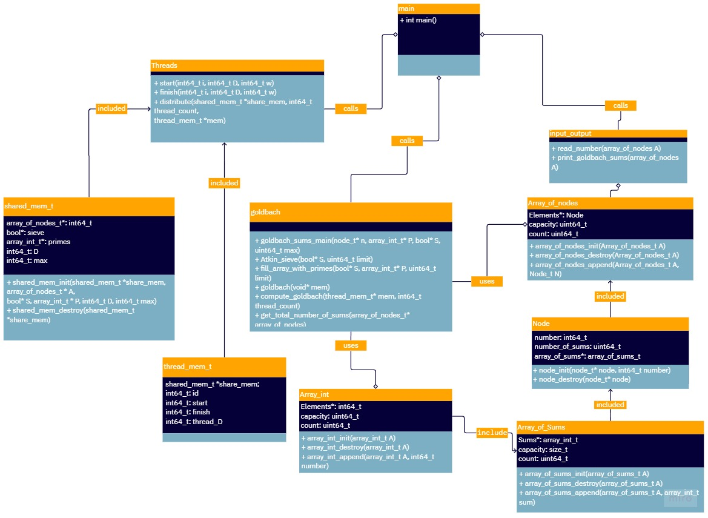
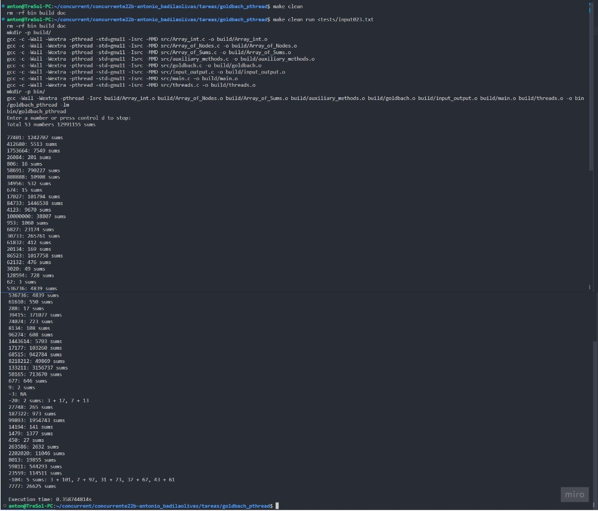

# Asigment 2 Goldbach_pthread
- Author: A Badilla Olivas
- Student ID: B80874

## Assigment summary 1
In this assigment students have to implement a simple program in ```
C``` that computes the sums of goldbach of a list of numbers. Even numbers have goldbach sums made of two prime numbers (strong conjectur) and odd numbers have goldbach sums compose of three prime numbers(weak conjectur). The program reads number by number inputs from the user and then printsthe value and then the number of possible goldbach sums for each number.

If the program receives a negative number it will print all posible goldbach sums of the absolute value of the number.

The program must stop if an invalid value is enter. An invalid value is something that is not a number or a number that is not an integer. Also, if the program receives a number is bigger than 64 bit int, it will print NA for that.

## Assigment summary 2
in this assigment students have to make their goldbach parallel using the techniques learn in the course. Students must not change the
the way in which they compute the sums of goldbach. They should rather make the computation of the sums of goldbach parallel.

## Analysis 1:
In this assigment of the most important elements to deal with is the generation of prime numbers. Having a list of prime numbers is essential to compute goldbach sums of any number. The most efficient methods to generate large amounts of prime numbers is using the sieves. There are several different sieves ranging from the ancient sieve of Eratosthenes tof the most efficient ones, the sieve of Atkin. For the design of this program will try to implement the sieve of Atkin as it offers a slightly better performance than the sieve of Eratosthenes for large numbers(for more details, see source number 1). In order of complexity the sieves are:
- Sieve of Eratosthenes:
$$  
O(n \cdot log(n))
$$ 
- Sieve of Atkin:
$$
O(n) 
$$

Furthermore, regarding goldbach's sums will divide the task between two functions. One function will compute the goldbach sums of even numbers and the other the sums of odd numbers. This will help optimize the way in which each process is done. in [goldbach_serial.pseudo](/design/goldbach_serial.pseudo) explains the two procedures proposed to compute the goldbach sums. In a few words the way in which the optimization is done is through putting a upper limit to the prime numbers the procedures will check applying the **Fundamental Theorem of Prime Numbers** which states: 

 >  The amount of primes numbers between 1 and n is tends to:  
 $$\frac{n}{ln(n)}$$
 > as n tends to infinity.
 
The main, original, optimized version is the one that is currently ready to be tested (for more than two days prior to the due date of this assigment it was an unstable realease, but at the moment of writting this all leaks, segmentation faults, lint, and other have been pulished adn repaired so that is good to go) it has passed all tests provided succesfully as well. 
The main version is compose of [main.c](/src/main.c), [goldbach.h](/src/goldbach.h) and [goldbach.c](/src/goldbach.c) alongside with input_output, Node, Array of Nodes, Array of int, Array of sums and Sieve. 

## Analysis 2:
For the purpose of this homework the only issue to solve is the distribution of work between threads. In this regard, this home has implemented a static block memory mapping in which threads are assign a continuos block of the work units in which they can work freely without other threads interfering. This conditionally safe approach is implemented using the functions start(i,D,w) and finish(i,D,w) seen and reviewed through the course. Examples of the memory mapping are shown in the following image:


Also, threads have share memory

All sanitizers have been passed by this parallel version of the program.

After the implementation of the parallel version of the program, the program UML diagram is as follows:



## User manual:
**Important**: common makefile needs the following addition: ```LIBS= -lm``` 
This to compile properly because of math.h library.

The program is compiled with the command:
```make```

and then it is executed with the command:
```./goldbach_pthread```

The program is also compile and run with the command:
```make run```

to run the tests provided:
```make test```

to run the tests in full sped:
```make clean release test```

to run a specific test:
```make run <tests/input0xx.txt> ```

when reading inputs, the scan will stop after pressing control + D. and that is it.

Here is an example of execution:



## Notes on implementation:
- when given an invalid too big input the program will print NA:NA for that number.
- when given an invalid input the program will stop reading inputs and end the program.
- when given number -2 to -3 it will print number:NA for that number.
- when given a number 0 to 5 it will print number:NA for that number.

## Bibliography:

1. Art of Problem Solving. (n.d.). Retrieved September 6, 2022, from https://artofproblemsolving.com/wiki/index.php/
2. Goldbach_Conjecture Atkin, A. O. L., & Bernstein, D. J. (2003). Prime sieves using binary quadratic forms. Mathematics of Computation, 73(246), 1023–1030. https://doi.org/10.1090/s0025-5718-03-01501-1 
3. Bhojasia, M. (2022, May 16). C Program to Implement Sieve of Atkin to Generate Prime Numbers. Sanfoundry. https://www.sanfoundry.com/c-program-implement-sieve-atkin-generate-prime-numbers-between-given-range/#:%7E:text=The%20sieve%20of%20Atkin%20is,multiples%20of%20the%20prime%20itself.
4.  Crandall, R., & Pomerance, C. B. (2005). Prime Numbers: A Computational Perspective (2nd ed.). Springer. 
5.  Eisenbud , D. (2017, May 24). Goldbach Conjecture - Numberphile [Video]. YouTube. Retrieved September 6, 2022, from https://www.youtube.com/watch?v=MxiTG96QOxw&feature=youtu.be 
6.  Find three prime numbers with given sum - GeeksforGeeks. (n.d.). Retrieved September 6, 2022, from https://www.geeksforgeeks.org/find-three-prime-numbers-with-given-sum/amp/ 
7.  GeeksforGeeks. (2021, May 24).Program for Goldbach’s Conjecture (Two Primes with given Sum). https://www.geeksforgeeks.org/program-for-goldbachs-conjecture-two-primes-with-given-sum/ 
8.   GeeksforGeeks. (2022, March 10). Sieve of Atkin. Retrieved September 4, 2022, from https://www.geeksforgeeks.org/sieve-of-atkin/
   
