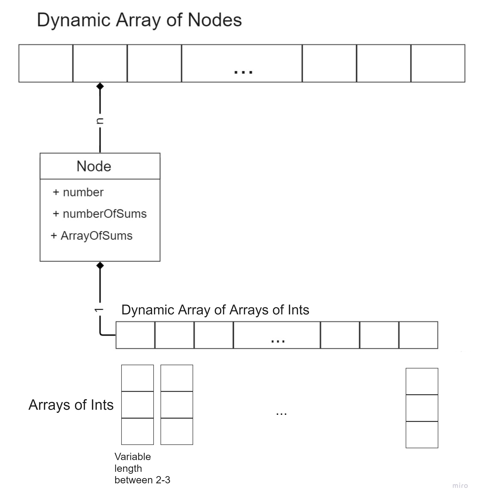
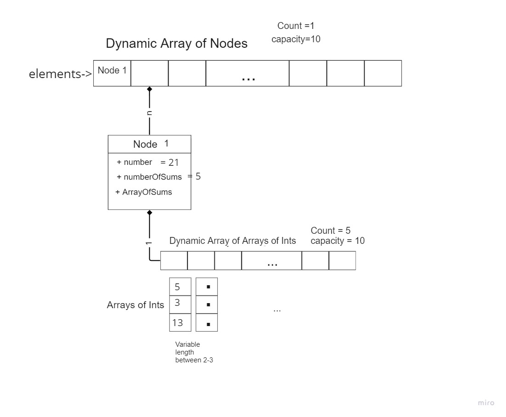

# Data structures
1.  **Node**
    -   number: to store number read from the user.
    -   number of sums: to store the amount of goldbach sums.
    -   Array of Arrays of intergers: to store the sums.
2.  **Array of Nodes: to store all the numbers.**

    

3.  **Array of booleans: to store the prime numbers in a mask**: This array will be used to store the prime numbers generated by the sieve of Atkin. The array will store 0 in if the position where the number is stored is not a prime number and 1 if it is a prime number. So if in index 2 there is a 0 it means that 2 is a prime number. It is also usefull to make searches of prime number in O(1) time.
    

4. **Array of intergers: to store prime numbers easier**: to store primes. this will be use to calculate the goldbach sums. 

Examples of the data structure is shown in the following image as a whole is shown in the following image:
## example with odd number
 
## example with even number

## example with invalid number

 here array of nodes stores count, capacity and an array of elements of type node. each node stores number, number of sums and an array of arrays of integers. Each array has a capacity and a count. An array of ints is also use to store primes.

